# Jangles Home Boarding, Walking & Day Care Website
Jangles Home Boarding, Walking & Day Care is a small, independent business in Caerphilly, South Wales that was established in 2014. It provides a home from home experience for your dog and goes the extra mile to ensure that your dog has the best time possible during their stay. It is a service me and my wife have used for 7 years with our two dogs, so we have first-hand experience of how wonderful it is and how well the dogs are treated. The business is heavily active on social media, however, they have not had a website for a number of years. I believe that a well-designed and informative website will be an invaluable tool in providing useful information to new and existing customers whilst promoting the brand.

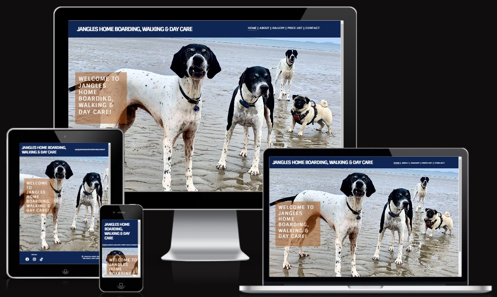

## User Experience (UX) & Design
---
### User Stories
- First Time Visitor

   - As a first time visitor, I want to get to understand the main purpose of the site.
   - As a first time visitor, I want to be able to easily navigate the site to find the content I require.
   - As a first time visitor, I want to know how much the services provided cost.
   - As a first time visitor, I want to see where the business is located.


- Returning Visitor

   - As a returning visitor, I want to easily view the gallery page.
   - As a returning visitor, I want to be able to contact the business owner about specific dates for boarding.
   
   
- Website Administrator
   
   - As a website administrator, I would like to display and update the gallery with ease.
   - As a website administrator, I would like to be contactable via the website directly to my email address.

### Color Scheme
After speaking to the business owner we agreed to utilise colours already in use on the business vehicle to give a recognisable palette. The following was generated by [coolors.co](https://coolors.co/0f2554-a5551a-3f3f3f-ffffff).


### Typography
Google Fonts were used to import the 'Poppins' and 'Sintony' font styles in the style.css file.

### Wireframes
Each link contains wireframes for mobile, tablet and desktop.
   - [Home/Index](documentation/index_home.png)
   - [About Us](documentation/about_us.png)
   - [Gallery](documentation/gallery.png)
   - [Price List](documentation/gallery.png)
   - [Contact Us](documentation/gallery.png)
   - [Thank You](documentation/thank_you.png) - This is displayed in place of an actual submission to a back end server.

---
## Features
---
### Navigation Bar
The Navigation bar provides users to navigate the site with ease. It's consitant presence at the top of the page allows users to find the content they require with a single click.


### Footer
The footer provides access to the social media links for the business in a clear and easy to understand format.


### Home page
The homepage provides an warm introductory to the website with a hero image of the resident dogs with clear site of the navigation bar to access the relevant areas of the site. The page is responsive with the position of the welcome text and hero image responding to larger screens.

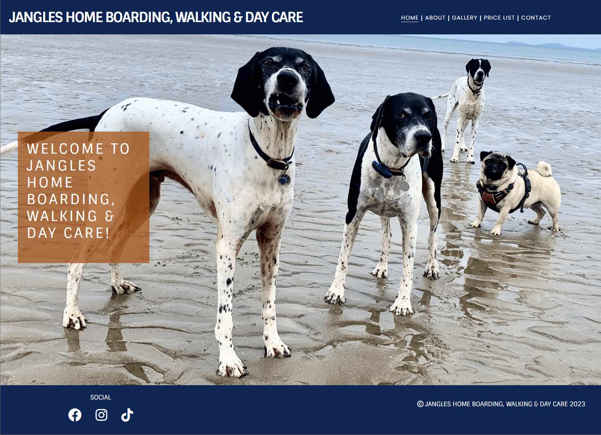
### About
The about page provides information about the owners, the business history and boarding license details, and a fun and informative profile about each of the resident dogs. The page is responsive with the images of the dogs under the profile appearing on larger screens and staying hidden on smaller devices.

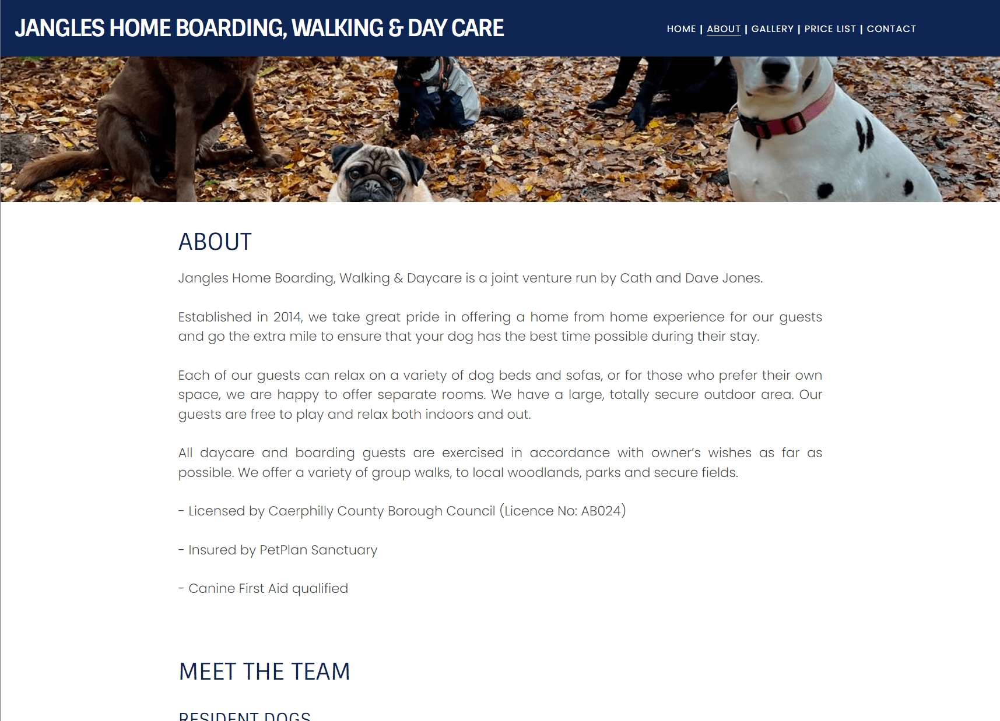
### Gallery
The gallery provides insight to what the guests are treated to whilst staying at Jangles. It has a responsive feature of changing from a single column on smaller devices to three then four on larger devices depending on screen size.

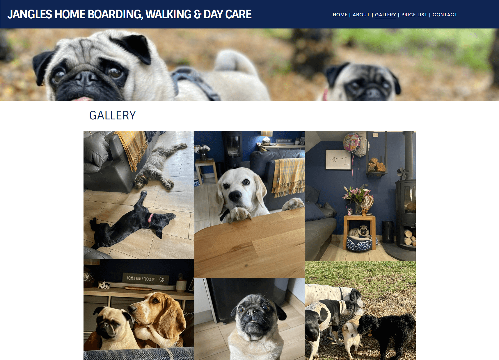
### Price List
The price list page provides the price for the services provided and the cancellation policy. The page is responsive dependent on screen size.

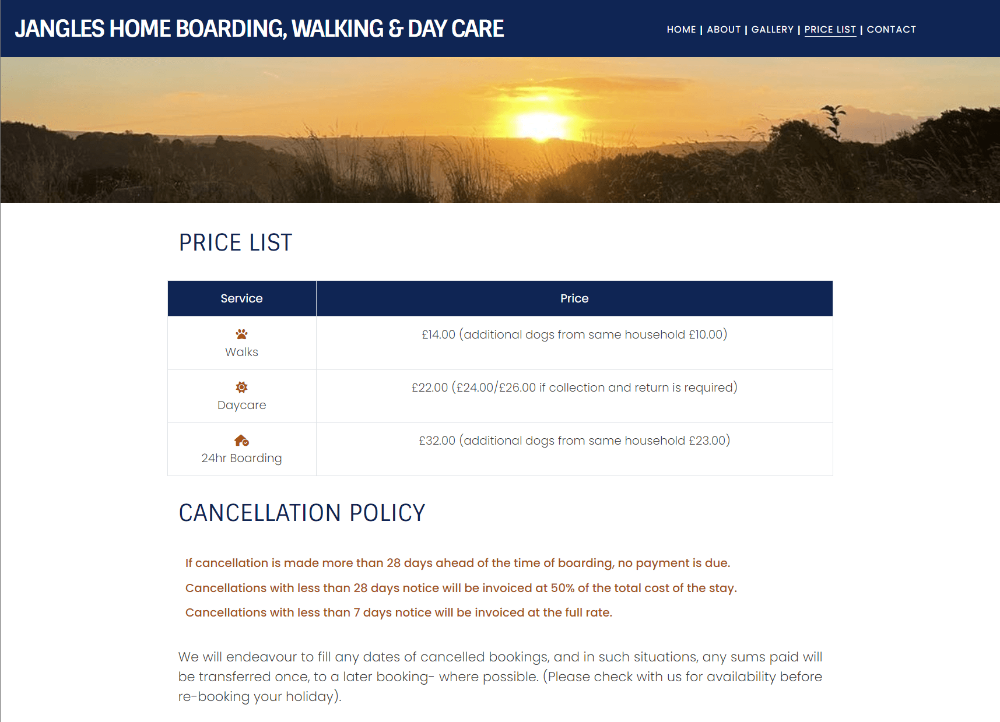
### Contact
The contact page provides information and tools to locate and contact the business. The form and map are responsive dependent on the size of the screen.

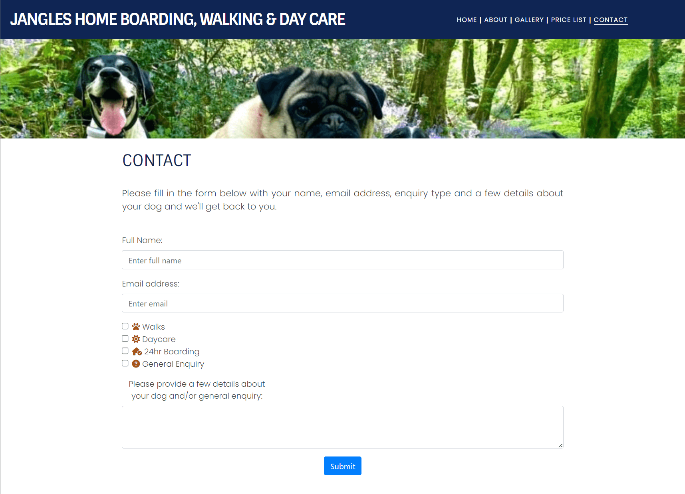
### Thank You
The thank you page is currently a place holder instead of the information being submitted to a backend server. The text advising when the team will be in contact is responsive dependent on screen size as is the hero image.


---
## Technologies Used
---
### Languages Used
- [HTML5](https://en.wikipedia.org/wiki/HTML5)
- [CSS3](https://en.wikipedia.org/wiki/Cascading_Style_Sheets)

### Frameworks, Libraries and Programs Used
- [Balsamiq](https://balsamiq.com/) was used for pre-visualisation of the pages.
- [Google Fonts](https://fonts.google.com/) was used to import the the 'Poppins' and 'Sintony' fonts into the style.css file.
- [Font Awesome](https://fontawesome.com/) was utilised for icons used on the site, including the socila media icons.
- [Bootstrap]() was used for responsive grids, table and elements of the contact form
- [Git](https://git-scm.com/) was used for version control. I utilised the CLI terminal in GitPod & codeanywhere to commit and push to GitHub.
- [GitPod](https://gitpod.io) was used as the cloud based enviroment based on VS Code to develop the site.
- [codeanywhere](https://www.codeanywhere.com) was also used as the cloud based enviroment based on VS Code to develop the site.
- [GitHub](https://github.com/) was used as the repository for the project after being pushed from GitPod.
- [Google Maps](https://www.google.com/maps) for the business location map.

## Testing
---
### Validator Testing
#### HTML
HTML Markup Validator results:
- [index.html](https://validator.w3.org/nu/?doc=https%3A%2F%2Fahendley84.github.io%2Fjangles-home-boarding%2Findex.html)
- [about.html](https://validator.w3.org/nu/?doc=https%3A%2F%2Fahendley84.github.io%2Fjangles-home-boarding%2Fabout.html)
- [gallery.html](https://validator.w3.org/nu/?doc=https%3A%2F%2Fahendley84.github.io%2Fjangles-home-boarding%2Fgallery.html)
- [price_list.html](https://validator.w3.org/nu/?doc=https%3A%2F%2Fahendley84.github.io%2Fjangles-home-boarding%2Fprice_list.html)
- [contact.html](https://validator.w3.org/nu/?doc=https%3A%2F%2Fahendley84.github.io%2Fjangles-home-boarding%2Fcontact.html)
- [thankyou.html](https://validator.w3.org/nu/?doc=https%3A%2F%2Fahendley84.github.io%2Fjangles-home-boarding%2Fthankyou.html)

#### CSS
W3C CSS Validator results [here](https://jigsaw.w3.org/css-validator/validator?uri=https%3A%2F%2Fahendley84.github.io%2Fjangles-home-boarding%2Fassets%2Fcss%2Fstyle.css&profile=css3svg&usermedium=all&warning=1&vextwarning=&lang=en#warnings)

### Browser Compatibility
The site has been tested on the following browsers (latest builds as of 24/04/2023):
- Google Chrome version Version 112.0.5615.138 (Official Build) (64-bit)
- Mozilla Firefox Version 112.0.1 (64-bit)
- Microsoft Edge Version 112.0.1722.58 (Official build) (64-bit)
- Apple Safari (Latest build on iOS 16.4.1)

### Manual Testing and Results
### User Story Tetsing
### Lighthouse Test
Each pages has been tested on mobile and desktop with the following table dsiaplying the results:

|Page|Device|Lighthouse Results|Notes|
|---|---|---|---|
|Index  |Mobile |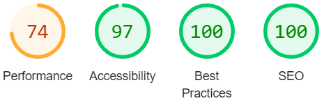|74 Performance score is due to images not being in next-gen format and render-blocking resources (Bootstrap)|
|Index  |Desktop |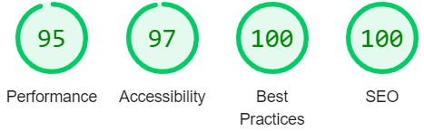||
|About  |Mobile |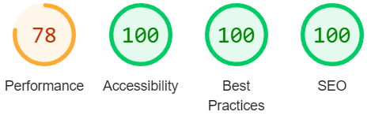|81 Performance score is due to images not being in next-gen format and render-blocking resources (Bootstrap)|
|About  |Desktop |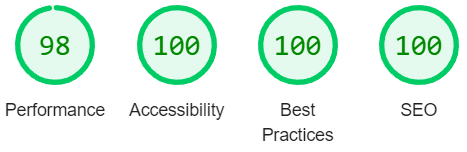||
|Gallery  |Mobile |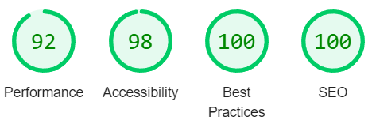||
|Gallery  |Desktop |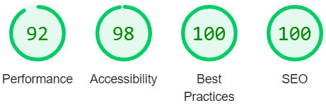||
|Price List  |Mobile |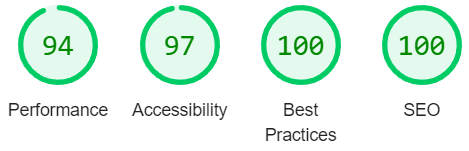||
|Price List  |Desktop |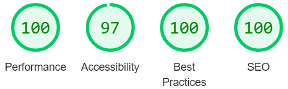||
|Contact  |Mobile |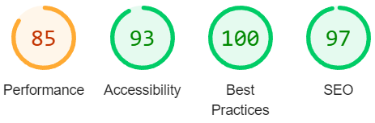|88 Performance score is due to images not being in next-gen format and render-blocking resources (Bootstrap)|
|Contact  |Desktop |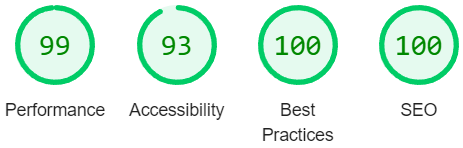||
|Thank You  |Mobile |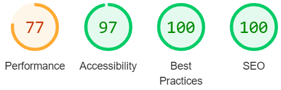|77 Performance score is due to images not being in next-gen format and render-blocking resources (Bootstrap)|
|Thank You  |Desktop |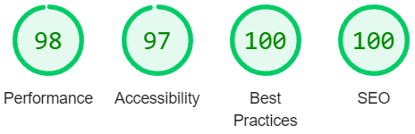||

**- As noted, the performance scores for some of the mobile pages drop to an average of 83. As the same issues are flagged, images not in a next-gen format and render-blocking resources, future builds of the website can look to move away from dependance on Bootstrap for some features and changing images to possible WebP or AVIF file types.**

### Responsiveness
### Bugs
- When setting up the contact form I was unable to align the submit button within a DIV to the center. I tried a few methods I thought would work with no such luck. A Google search provided the answer and the following code resolved the issue:
```css
.button_position {
    display: block;
    margin: 0 auto;
}
```
Acknowledged in the credits section for the assitance provided.

- I was experiencing side-scroll on the mobile version of the contact page. The input boxes were exceeding the width of the screen and causing the side scroll.  I added the following code to my CSS targeting the form and this seems to have resolved the issue:
```css
max-width: 300px;
```
However, I believe this to be a temporary solution to one problem as the input boxes still expand to the maximum width of the container. I'll look to amend this in a further update where the information this page expands from a single column on mobile to 3 columns on desktop in a future update.

### Unfixed Bugs
---
## Deployment
---
### How the site was deployed
---
## Credits & Acknowledgements
---
- Credit to RenatoSZ at [Stackoverflow](https://stackoverflow.com/questions/7560832/how-to-center-a-button-within-a-div) for his answer in helping me align my submit button within a DIV tag.
- A massive thank you to Cath Jones of Jangles Home Boarding, Walking & Day Care for allowing me to use all the wonderful images she has taken of the dogs in her care.
- Thank you to my mentor for his support and guidance through the process and for the idea of the 'thankyou.html' page to give the impression that the inputting of data achieved a result and a good use experience.